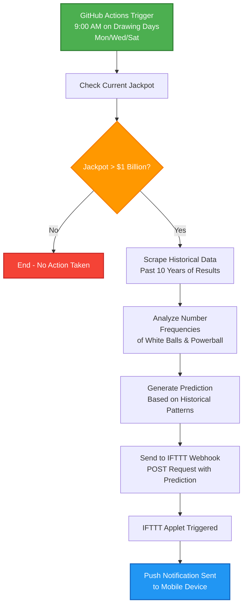

# 🎰 Florida Powerball Predictor 🎰

An automated Powerball number prediction system that analyzes historical lottery data to generate predictions and sends notifications when jackpots exceed $1 billion.

## Features

- **Historical Data Collection**: Scrapes 10+ years of Powerball results from official website
- **Frequency-Based Predictions**: Generates number predictions based on historical frequency patterns
- **Smart Notifications**: Automatically sends push notifications via IFTTT when jackpots exceed $1B
- **Automated Monitoring**: Checks current jackpot amounts and triggers predictions accordingly

## System Flow



## How It Works

1. **Data Collection** (`dataGatherer.py`): Uses Selenium to scrape historical Powerball results
2. **Prediction Engine** (`predictNumbers.py`): Analyzes number frequencies to generate predictions
3. **Jackpot Monitoring** (`main.py`): Checks current jackpot and triggers system when threshold is met
4. **Notifications** (`notifier.py`): Sends predictions via IFTTT webhooks

### Setup
```bash
git clone https://github.com/yourusername/powerball-predictor.git
cd powerball-predictor
pip install -r requirements.txt
```

## Example Output

```
Current Jackpot: $1.40 Billion
Jackpot exceeds $1B, generating prediction...
Clicked 'Load More' button. . .
Gathering more data. . .
Reached 10 years of data: 2014-12-15 00:00:00
White balls: [12, 23, 44, 57, 61] Powerball: 18
IFTTT notification sent successfully!
```

## Technical Details

### Data Collection Strategy
- Scrapes official Powerball website for maximum accuracy
- Collects 10+ years of historical results automatically
- Handles dynamic loading with Selenium automation

### Prediction Algorithm
- Analyzes frequency patterns of white balls (1-69) and Powerball numbers (1-26)
- Uses weighted random sampling based on historical occurrence rates
- **Note**: This is for entertainment purposes only - lottery numbers are random!

### Notification System
- Integrates with IFTTT for flexible notification options
- Only triggers when jackpots exceed $1 billion threshold
- Customizable message format and delivery methods

## Project Structure

```
powerball-predictor/
├── main.py              # Main orchestration script
├── dataGatherer.py      # Web scraping and data collection
├── predictNumbers.py    # Prediction algorithm
├── notifier.py          # IFTTT notification system
└── README.md           # This file
```

## Limitations & Disclaimers

⚠️ **Important**: This project is for educational and entertainment purposes only.

- Requires stable internet connection for web scraping
- ChromeDriver compatibility needed for Selenium
- Rate limiting may affect data collection speed or may cause script to fail
- IFTTT webhook has usage limits

## Contributing

Contributions are welcome! Please feel free to submit a Pull Request. For major changes, please open an issue first to discuss what you would like to change.

## License

This project is licensed under the MIT License - see the [LICENSE](LICENSE) file for details.

## Acknowledgments

- Official Powerball website for providing historical data
- IFTTT for notification services
- Selenium and BeautifulSoup communities for web scraping tools

---

**Disclaimer**: Gambling can be addictive. Please play responsibly and within your means. This tool is for entertainment and educational purposes only.
